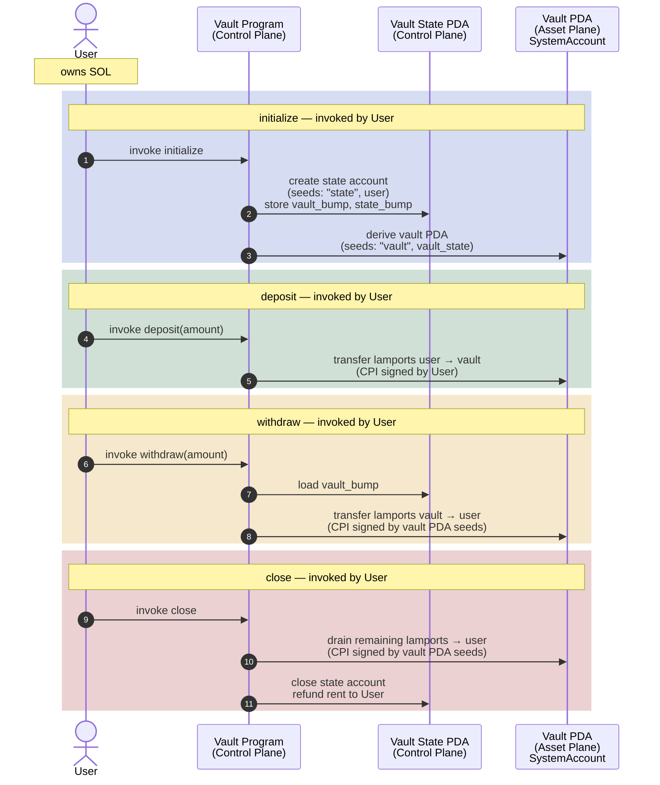

# Vault: Per-User SOL Custody

A user opens a personal vault, deposits SOL into it, withdraws SOL on
demand, and eventually closes it to reclaim rent.

The vault is a PDA-controlled system account. Lamports sit in the vault
PDA; the program signs withdrawals on the user's behalf using the
vault's signer seeds.

The four instructions are:

1. `initialize` — create the vault state PDA and the vault PDA
2. `deposit` — move lamports from the user into the vault
3. `withdraw` — move lamports from the vault back to the user (PDA signs)
4. `close` — drain remaining lamports to the user and close the state account

Each user gets at most one vault, keyed by their own pubkey. There is
no shared custody and no counterparty: the user is the only party who
can deposit, withdraw, or close.

---

# Vault State (PDA)

The vault state PDA stores the bumps needed to re-derive both PDAs on
every instruction (so the program does not have to recompute them).

| Field        | Purpose                                          |
| ------------ | ------------------------------------------------ |
| `vault_bump` | Bump for the vault SystemAccount PDA             |
| `state_bump` | Bump for this state account                      |

PDA seeds:

* `vault_state`: `["state", user]`
* `vault`:       `["vault", vault_state]`

The vault itself holds no data; it is a `SystemAccount` whose lamport
balance _is_ the user's deposit. All authority over those lamports flows
through the vault PDA's signer seeds.

---

# Architecture Model

## Control Plane

Coordinates:

* instruction execution
* authority validation (vault state is bound to the signing user via seeds)
* vault lifecycle (initialize and close)
* PDA signing for withdrawals and the final drain

Components:

* User
* Vault Program
* Vault State PDA (carries the bumps; closed on `close`)

The Vault State PDA is the control-plane anchor: its seeds bind the
vault to one specific user, and its stored bumps let every subsequent
instruction reconstruct the vault PDA without re-deriving it.

## Asset Plane

Holds custody of the actual lamports.

Components:

* Vault PDA (a `SystemAccount`)
* User's wallet

The vault PDA's authority is itself (it is a system account whose
"owner" is the System Program, but its lamports can only be moved
through a CPI signed with its PDA seeds). The vault program produces
those signer seeds on `withdraw` and `close`, which is what makes
withdrawals trustless: only this program, with the matching seeds, can
authorize an outflow.

# Flow




## A note on closing

These are my learning notes; I'm new to Solana, so I'm going to hedge a fair
amount and flag the bits I'm guessing at. Treat anything below as "current best
understanding, worth verifying" rather than gospel.

<details> <summary>Click to view detailed notes</summary>

If you read `close.rs` carefully, you'll notice something a little odd. The
instruction touches two PDAs, `vault` and `vault_state`, and it shuts them both
down; but it does so in two very different ways. The `vault_state` account gets
the Anchor `close = user` constraint (close.rs:23), the Anchor (or Solana?)
incantation for "close this account and refund the rent". The `vault` account
gets... nothing of the sort. It just gets a CPI that transfers out all of its
lamports, the same shape of CPI we already use in `withdraw`.

A natural question: why the asymmetry? They're both PDAs of this program;
shouldn't they close the same way?

The answer, I think, falls out of a small mental model I'm using to read
Solana. Worth flagging up front: this is my own framing, not something I'm
quoting from the docs, and it's load-bearing for the rest of this section.
If the model is wrong, the section is wrong.

### Two capabilities: owner and authority

Every account on Solana, as I read it, sits at the intersection of two
distinct capabilities:

* **Ownership** is a *runtime-enforced* capability. The loader itself only
  lets the owning program mutate an account's data, and (I believe) only the
  owning program can decrement an account's lamports. The owner is the only
  entity with the structural ability to act *on* the account.

* **Authority** is a *program-enforced* capability, layered on top.
  An authority is whoever the owning program has decided to accept commands
  from for a given action (a signer, a PDA, a specific pubkey stored in the
  account's data). The authority does not act on the account directly; it
  produces a signed request, and the owner translates that request into the
  actual mutation.

So the shape of every state-changing operation appears to be the same:
**authority asks, owner executes**. The runtime polices ownership; programs
police authority. The owner is the trusted handler; the authority is the
permitted requester.

(One wrinkle worth flagging, even though it doesn't bite us here: anyone can
*increase* an account's lamport balance with no capability check. The
ownership capability seems to be specifically about debits and data writes,
not credits. Worth locking down in production apps, not this learning one)

### A brief word on rent

One more piece of vocabulary. My understanding is that every Solana account
must hold a minimum lamport balance to stay alive, called the *rent-exempt
minimum*, and that the amount scales with the account's size in bytes. I
believe that if an account's balance hits zero, the runtime purges it and the
address becomes reusable. So "closing" an account, in this context, seems to
reduce to: drain its lamports, and (if data lives in it) wipe the data so a
future read can't be fooled by stale bytes.

(N.B.: a non-zero balance below the rent-exempt minimum is a liminal state.
Historically I gather the runtime could purge such accounts during rent
collection; modern Solana doesn't auto-purge, as best I can tell. The working
model I'm using is: zero means gone, rent-exempt minimum or above means alive,
don't park accounts in between.)

### The two accounts, through the capability lens

With the model in hand, the asymmetry collapses to a single observation: the
two accounts have *different owners*, so different programs run their
respective closes. Side by side:

|                  | `vault`                              | `vault_state`                                    |
| ---------------- | ------------------------------------ | ------------------------------------------------ |
| Anchor type      | `SystemAccount`                      | `Account<VaultState>`                            |
| Owner            | System Program                       | this program (the vault program)                 |
| Authority        | this program, via PDA signer seeds   | the user, via `Signer<'info>` on the instruction |
| Holds data?      | no; just lamports                    | yes; discriminator + bumps                       |
| Close executor   | System Program (because owner)       | this program (because owner)                     |

Both columns describe the same kind of operation under the model: authority
asks, owner executes. What changes between them is *who the owner is*, and
therefore *which program's code* runs the close.

A small but important point about the `vault` column: the account's address
is derived from this program's ID (so it's a PDA *of* this program), but its
owner is the System Program. PDA-of and owned-by are not the same thing, and
the capability model makes that distinction operational: ownership is the
runtime capability, PDA derivation is just an address scheme. The vault
program's relationship to the vault account is as its authority, not as its
owner.

### What `close` actually does, through this lens

Two actions happen in `close.rs`, and each one is an instance of the pattern:

1. **Drain the vault.** The vault program (authority) sends a CPI to the
   System Program (owner), signed with the vault PDA's seeds (close.rs:32-48).
   The System Program performs the lamport debit, because it owns the
   account. After the CPI, `vault.lamports() == 0`, and my working
   assumption is that the runtime cleans up the empty system account on its
   own; no explicit close call needed. (I don't think the System Program
   even exposes one, but I haven't verified that.)

2. **Close the state account.** The user (authority) signs the instruction;
   Anchor sees the `close = user` constraint and, at end-of-instruction, has
   the owning program (us) drain the state account's lamports to the user,
   zero out its data, and reassign ownership back to the System Program.
   I'm taking the exact sequence from Anchor's docs rather than from reading
   the macro, so worth confirming if the details matter.

Why can't step 2 also go through a system transfer? Because `vault_state`'s
owner is us, not the System Program: the System Program has no runtime
capability to debit lamports from an account it doesn't own. The work has to
be done by the owning program, which is this one. Anchor's `close = user`
appears to be the standard sequence the owner runs when an authorised
request to close arrives.

### The slogan

If you want a one-liner: **the asymmetry isn't a quirk; it's the capability
model showing up in the code. Same operation, different owner, different
program's code runs the close.**

(Caveats from earlier still apply: the rent-purge behavior, the System
Program's exact debit rules, the precise steps in Anchor's `close` macro,
and even the framing above are all things I'd want to verify against
authoritative sources before relying on them.)

</details>


## Example Run (with --nocapture)

<!-- test output goes here -->
running 1 test
test test_id ... ok

test result: ok. 1 passed; 0 failed; 0 ignored; 0 measured; 0 filtered out; finished in 0.00s


running 1 test
test test_initialize_deposit_withdraw_close ... 

### Vault Initialize


```console
=== Structured Transaction Logs ===
Instruction: instruction to Bgs4A9r5k4VXFuG7cC1iXDQdEB4v5tjbBbP1wwh7Nyxd
Transaction
└── Bgs4A9r5k4VXFuG7cC1iXDQdEB4v5tjbBbP1wwh7Nyxd [1] ✓ 14317cu
    └── 11111111111111111111111111111111 [2] ✓
Compute Units: 14317
====================================

```


### Vault Deposit


```console
=== Structured Transaction Logs ===
Instruction: instruction to Bgs4A9r5k4VXFuG7cC1iXDQdEB4v5tjbBbP1wwh7Nyxd
Transaction
└── Bgs4A9r5k4VXFuG7cC1iXDQdEB4v5tjbBbP1wwh7Nyxd [1] ✓ 6551cu
    └── 11111111111111111111111111111111 [2] ✓
Compute Units: 6551
====================================

```


### Vault Withdraw


```console
=== Structured Transaction Logs ===
Instruction: instruction to Bgs4A9r5k4VXFuG7cC1iXDQdEB4v5tjbBbP1wwh7Nyxd
Transaction
└── Bgs4A9r5k4VXFuG7cC1iXDQdEB4v5tjbBbP1wwh7Nyxd [1] ✓ 6628cu
    └── 11111111111111111111111111111111 [2] ✓
Compute Units: 6628
====================================

```


### Vault Close


```console
=== Structured Transaction Logs ===
Instruction: instruction to Bgs4A9r5k4VXFuG7cC1iXDQdEB4v5tjbBbP1wwh7Nyxd
Transaction
└── Bgs4A9r5k4VXFuG7cC1iXDQdEB4v5tjbBbP1wwh7Nyxd [1] ✓ 7423cu
    └── 11111111111111111111111111111111 [2] ✓
Compute Units: 7423
====================================

```

ok

test result: ok. 1 passed; 0 failed; 0 ignored; 0 measured; 0 filtered out; finished in 0.05s

